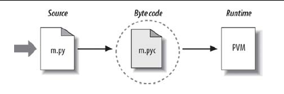

#第二章Python如何运行程序学习总结

###什么是python解释器
它是运行python程序的程序。当从python官方网站下载安装python安装软件包安装以后，
由一个解释器和一些支持库构成，编写的python代码必须在解释器中运行，
为了运行python程序，要在计算机上安装python解释器。

###python执行过程
1.编辑源代码(.py)
2.丢给python运行，产生字节码.pyc
3..pyc字节码在PVM中运行

###python替代者
1.Cpython：就是从python的主流版本，标准版本，从python官方网站下载的版本。
2.Jython：编译python源代码成java字节码，在java虚拟机上运行。较慢不够健壮。
3.IronPython：在.NET中集成python
4.stackless:面向并行（concurrency)
5.pypy:python for speed
###python发布
使用py2exe,pyinstaller可以将源代码和虚拟机打包成

  